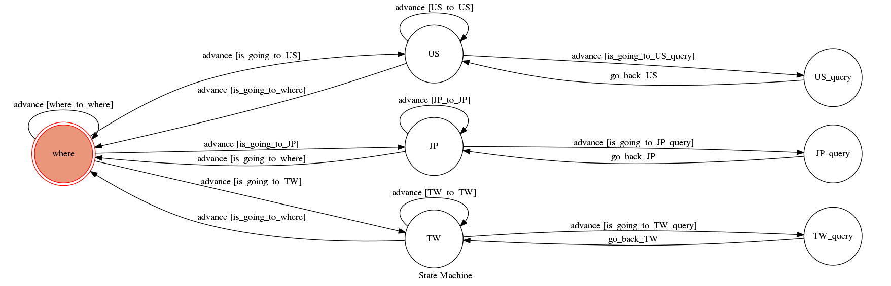

# telegram_bot
A telegram bot for theory of computation final project.

這個聊天機器人最終的目的是可以用來查詢各種體育的隊伍數據，數據來源是個各個數據網站的資料。
目前支援的體育賽事有：
```
MLB
NPB(未完成)
CPBL(未完成)
```

目前支援的棒球隊伍數據有：
```
打擊率
上壘率
長打率
```

## 程式執行方法

1.確認自己有安裝python3
```
sudo apt-get install python3-all
```
2.安装python3的python-pip
```
sudo apt-get install python3-pip
```
3.有些人在安裝某些module的時候會失敗，解決的方法是執行
```
sudo pip3 install --upgrade pip
```
4.安裝程式相依的module
```
pip3 install -r requirement.txt
```
5.準備執行程式，在這之前必須設定兩個程式裡的變數，編輯`app.py`更改兩個變數的內容
```
API_TOKEN = '你申請的telegram bot HTTP API token'
WEBHOOK_URL = 'https server url'
```
6.我們使用ngrok來暫時代替一個真正的http server(github附的ngrok是linux-64bit的執行檔)
Flask預設port是5000
```
./ngrok http 5000
```
7.複製ngrok產生的`https url`加上`/hook`到WEBHOOK_URL，例如：
```
https://56790d34.ngrok.io/hook
```
每次執行ngrok得到的url都會不一樣，記得都要重新設定

8.執行Flask server
```
python3 app.py
```


## 聊天機器人使用方法

1.先選擇賽區:
US 查詢MLB
JP 查詢NPB
TW 查詢CPBL

2.根據不同賽區有不同隊數，選擇球隊：
例如MLB可以輸入0～30
0代表重新選擇賽區
1~30代表取得不同隊的數據

3.根據不同隊的要求，會回報要求隊伍的數據內容，然後可以再次選擇隊伍


## 備註
1.目前因為不同賽區的數據要在不同網頁抓，所以尚未完成NPB和CPBL的部份，但為了符合作業basic要求，還是確實可以進入後面state，不過目前回報的數據內容是寫死的，不是即時數據。

2.未來可以考慮加入防禦率，歷史對戰紀錄數據

3.未來可以考慮加入籃球項目數據

4.未來可以考慮加入自動數據分析

這樣我以後玩運彩就可以靠這個分析過盤率了


